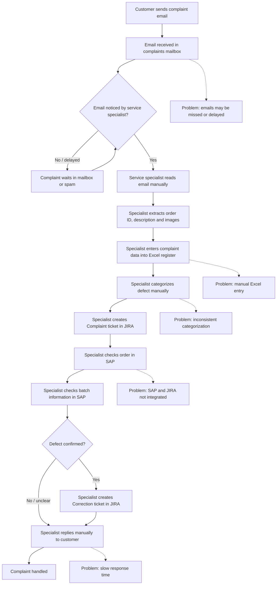

# AS-IS Event Storming — Current Complaint Handling Process

## Goal

This document describes the current complaint handling process at Metalpol before introducing AI automation.

## Business Context

Metalpol receives customer complaints by email. Each complaint may include an order number, a description of the defect in Polish or English, and one or more defect images.

Currently, the process is mostly manual. A service specialist reads the email, extracts the relevant information, updates an Excel register, creates a JIRA ticket, checks order and batch information in SAP, and replies to the customer manually.

## Main Problems

- Complaint emails may be delayed or missed due to spam or manual mailbox monitoring.
- Data is copied manually into Excel, which increases the risk of errors.
- Defect categorization is inconsistent between specialists.
- JIRA and SAP are not integrated.
- There are no reliable metrics for complaint volume, defect types, or problematic production lines.
- Customer response time is too slow, with an average delay of around two days.

## AS-IS Process Diagram

## Event Storming Elements

### Events

Events describe something that has already happened in the business process.

- Complaint email received
- Complaint email read
- Complaint data entered into Excel
- Defect categorized
- JIRA Complaint ticket created
- SAP order checked
- SAP batch checked
- Customer response sent
- Correction ticket created

### Commands

Commands describe an intention to do something.

- Read complaint email
- Register complaint
- Categorize defect
- Create JIRA Complaint ticket
- Check order in SAP
- Check batch in SAP
- Send response to customer
- Create JIRA Correction ticket

### Actors

- Customer
- Service specialist
- Quality department
- SAP system
- JIRA system

### External Systems

- Microsoft 365 / Exchange mailbox
- Excel complaint register
- SAP ERP
- JIRA Cloud

## Summary

The current process depends heavily on manual work performed by the service specialist. The main bottlenecks are mailbox monitoring, manual data entry, subjective categorization, lack of integration between SAP and JIRA, and limited reporting capabilities.