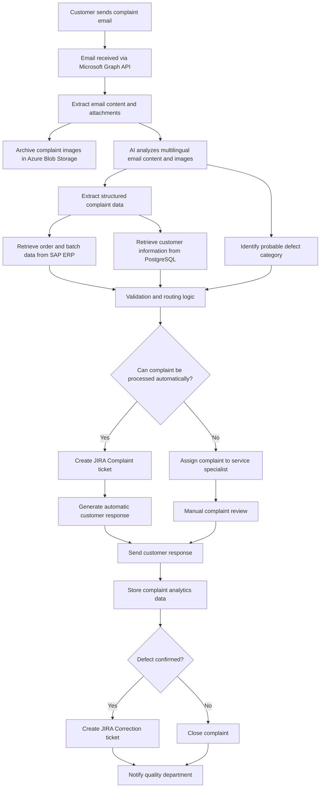

# TO-BE Event Storming — Automated Complaint Handling Process

## Goal

This document describes the proposed automated complaint handling process using AI-assisted automation and enterprise system integrations.

The main goals are:
- reducing repetitive manual work,
- improving defect categorization consistency,
- accelerating customer response time,
- improving operational visibility and reporting.

---

## TO-BE Process Overview

The proposed solution automatically processes incoming complaint emails using Microsoft Graph API webhooks.

The system extracts structured information from multilingual emails and attached defect images, archives complaint images in Azure Blob Storage, retrieves order and batch data from SAP ERP, and automatically creates JIRA tickets.

AI is used primarily for processing unstructured complaint content, while business-critical validation relies mainly on SAP production and batch information.

Rule-based validation and routing logic determines whether the complaint can be processed automatically or requires human review.

---

## TO-BE Process Diagram

---

## Event Storming Elements

### Events

Events describe facts that already happened in the business process.

- Complaint email received
- Complaint attachments extracted
- Complaint images archived
- Complaint data extracted
- Defect category identified
- SAP order data retrieved
- Customer information retrieved
- Complaint evaluated
- JIRA Complaint ticket created
- Customer response generated
- Complaint assigned to specialist
- Complaint reviewed manually
- JIRA Correction ticket created
- Complaint closed

---

### Commands

Commands describe actions or intentions executed by the system or users.

- Receive complaint email
- Extract complaint data
- Archive complaint images
- Analyze complaint content
- Identify defect category
- Retrieve SAP order data
- Retrieve customer information
- Validate complaint
- Create JIRA Complaint ticket
- Generate customer response
- Assign complaint to specialist
- Create JIRA Correction ticket
- Close complaint

---

### Actors

- Customer
- Automated complaint processing system
- Service specialist
- Quality department

---

### External Systems

- Microsoft 365 / Exchange
- Microsoft Graph API
- SAP ERP (PP/QM)
- JIRA Cloud
- PostgreSQL customer database (read-only)
- Azure Blob Storage (image archive with SAS-token access)

---

## Key Improvements Over AS-IS

- Automatic email ingestion reduces missed or delayed complaints
- AI-assisted categorization improves consistency between specialists
- SAP integration accelerates complaint validation
- Automatic JIRA ticket creation reduces repetitive manual work
- Complaint images are archived automatically
- Structured analytics data improves operational reporting
- Faster response time improves customer experience

---

## Human-in-the-loop Strategy

Not all complaints are processed automatically.

Human review is required when:
- complaint data is incomplete,
- AI confidence is low,
- SAP validation fails,
- image quality is insufficient,
- the complaint is considered high-risk or complex.

This approach balances automation efficiency and operational reliability.

---

## Summary

The proposed TO-BE process introduces AI-assisted automation while preserving human oversight for uncertain or critical cases.

The architecture prioritizes SAP-based validation, practical enterprise integration, and realistic automation boundaries rather than full AI autonomy.