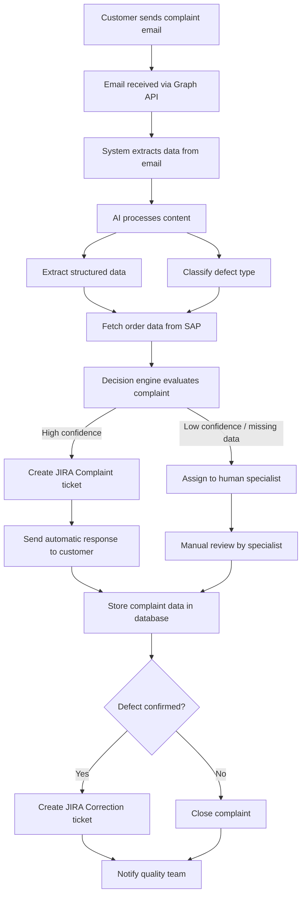

# TO-BE Event Storming — Automated Complaint Handling Process

## Goal

This document describes the proposed automated complaint handling process using AI and system integrations.

The goal is to reduce manual work, improve consistency, and speed up customer response time.

---

## TO-BE Process Overview

The system automatically processes incoming complaint emails, extracts relevant information, classifies the defect using AI, retrieves order data from SAP, and creates a JIRA ticket.

A decision engine determines whether the complaint can be handled automatically or requires human intervention.

---

## TO-BE Process Diagram

---

## Event Storming Elements

### Events

- Complaint email received
- Complaint data extracted
- Defect classified
- SAP order data retrieved
- Complaint evaluated
- JIRA Complaint ticket created
- Customer response sent
- Complaint reviewed manually
- Correction ticket created
- Complaint closed

---

### Commands

- Receive email
- Extract complaint data
- Classify defect
- Retrieve order data from SAP
- Evaluate complaint
- Create JIRA ticket
- Send response to customer
- Assign to specialist
- Create correction ticket

---

### Actors

- Customer
- Automated system
- Service specialist
- Quality department

---

### External Systems

- Microsoft Graph API (email ingestion)
- SAP ERP (order and batch data)
- JIRA (ticket management)
- PostgreSQL (data storage)
- Azure Blob Storage (images)

---

## Key Improvements Over AS-IS

- Automated email processing → no missed complaints
- AI-based classification → consistent categorization
- Integration with SAP → faster decision making
- Automatic ticket creation → reduced manual work
- Faster customer response → improved customer experience
- Centralized data storage → analytics and reporting

---

## Human-in-the-loop Strategy

Not all complaints are processed automatically.

If:
- data is missing
- classification confidence is low
- case is complex

→ the complaint is routed to a human specialist.

This ensures reliability and reduces risk.

---

## Summary

The TO-BE process introduces automation at key steps while preserving human control for complex cases. This approach balances efficiency and reliability.